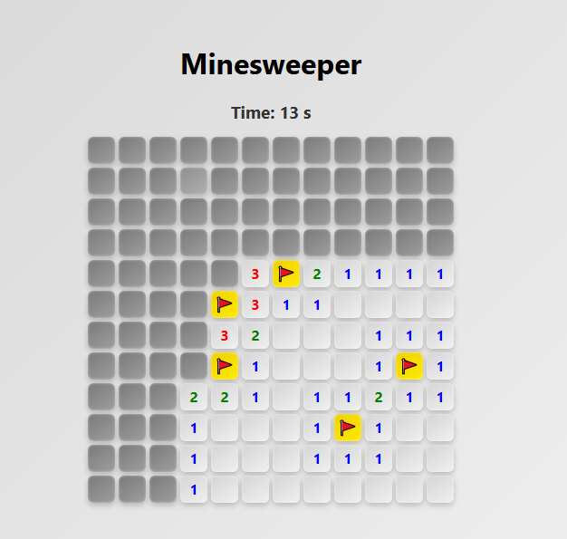

# Minesweeper Game (React)

A fully functional, classic Minesweeper game built entirely in **React**.



## Features

- Classic Minesweeper gameplay
- Recursive empty tile reveals
- Flagging functionality with custom flag icons (right-click to place/remove flags)
- Timer with game over detection
- Win condition when all safe tiles are revealed
- Clean, modern UI with hover effects and subtle animations

## Tech Stack

- **React** (functional components and hooks)
- Plain CSS for styling (no external libraries)

## Why this project?

I built this project to:

- Improve my skills in React and frontend component design
- Practice clean state management and recursive logic
- Create a fun, nostalgic game that looks modern and works smoothly

## How to Play

1. Click tiles to reveal them.
2. Avoid mines (bomb tiles).
3. Right-click (or long-tap on mobile) to place or remove flags.
4. Clear all safe tiles to win and see "Success!"

## Getting Started

```bash
git clone https://github.com/yourusername/minesweeper-react.git
cd minesweeper-react
npm install
npm start
